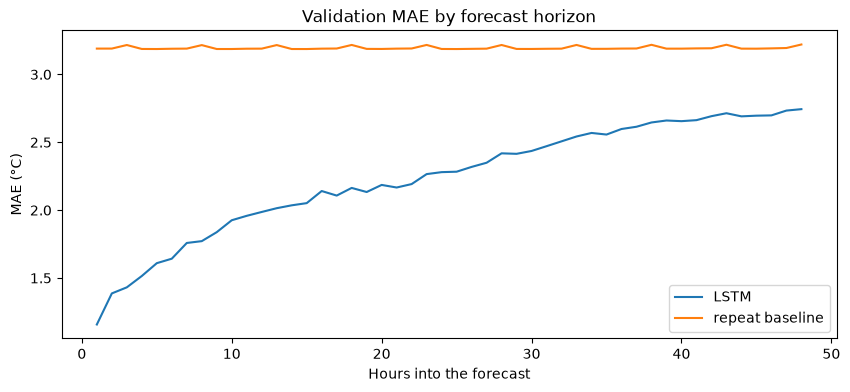
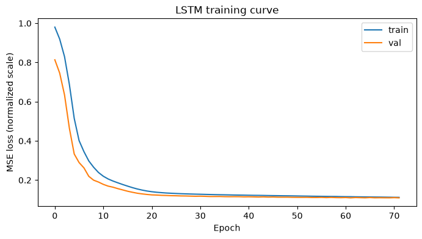

# Time Series Forecasting

Forecasting temperature (`T (degC)`) 48 hours ahead from a week of prior weather observations, on the [Max Planck Institute weather dataset](https://www.bgc-jena.mpg.de/wetter/) (hourly, 2009-2016, 19 features). Three model families (naive baselines, linear regression, LightGBM, and an LSTM) are trained on identical windowed data and scored through the same evaluation pipeline, so the comparison below is apples-to-apples.

## Results

All models evaluated with `evaluate_model` (predictions rescaled to °C and clipped to the train-set range) on validation (2013-2014) and test (2015-2016), neither of which any model, including LightGBM/linear regression hyperparameters, chosen ahead of time, was fit on.

| model               | val MAE (°C) | test MAE (°C) |
|---------------------|-------------:|--------------:|
| **LSTM**            |     **2.24** |       **2.34** |
| LightGBM             |         2.28 |           2.37 |
| Linear regression    |         2.32 |           2.45 |
| Repeat baseline      |         3.20 |           3.48 |
| Mean baseline        |         3.52 |           3.74 |
| Last-step baseline   |         3.53 |           3.80 |

The LSTM comes out ahead, but only once it's actually trained to convergence.  Adding early stopping (`src/training.py`) revealed validation loss was still improving at epoch 20, it doesn't plateau until epoch ~62 (72 epochs run, 10-epoch patience). Retrained to that actual plateau, the LSTM's test MAE drops to 2.34°C, ahead of LightGBM. All three trained models beat the naive baselines by roughly 1-1.1°C of MAE, and the margin between the top three is itself fairly narrow (2.34-2.45°C).

Error also isn't uniform across the 48-hour horizon, it roughly doubles from the 1-hour mark to the 48-hour mark:





## What this project demonstrates

Beyond fitting models, the notebook is written to hold up under scrutiny:
- **No leakage in preprocessing**: normalization statistics (`Standardizer`) are fit on the train split only and reused everywhere downstream.
- **An actual leakage check, with a real finding**: the correlation-based feature drop was originally computed on the full 8-year dataset; recomputing it on train-only data shows it *does* change the outcome for one feature, right at the 0.95 threshold boundary — reported honestly rather than assumed away (section III.1 of the notebook).
- **Baselines before models**: three naive baselines are evaluated first so the trained models have something meaningful to beat.
- **Claims are backed by plots, not prose, and re-checked when the plot disagrees**: the original draft asserted "10 epochs because it overfits after that" with no evidence; the actual loss curve showed the opposite (still improving at epoch 20), which led to adding early stopping and retraining, which in turn *changed which model wins*. See the Results section above.
- **A fair multi-model comparison**: every model (baselines, linear regression, LightGBM, LSTM) goes through the same `evaluate_model` (rescale + clip), on both validation and test.

## Project structure

```
├── modeling.ipynb          # analysis notebook: EDA, preprocessing, training, evaluation
├── visualization.py        # plot_window: visualize samples/labels/predictions
├── src/                    # reusable pipeline code, imported by the notebook
│   ├── windowing.py         #   sliding-window extraction + time-step regularity check
│   ├── scaling.py            #   Standardizer (fit on train, reused everywhere)
│   ├── baselines.py          #   naive forecasting baselines
│   ├── models.py              #   LSTMForecaster
│   ├── training.py            #   LSTM training loop with early stopping (returns loss history)
│   └── evaluation.py          #   evaluate_model, mae_by_horizon
├── tests/                  # pytest unit tests for src/
├── data/weather_dataset.csv
└── assets/                 # plots referenced by this README
```

## How to run

```bash
python3 -m venv .venv
source .venv/bin/activate
pip install -r requirements-dev.txt   # requirements.txt alone is enough to just run the notebook
```

Run the tests:

```bash
pytest tests/
```

Run the notebook:

```bash
jupyter notebook modeling.ipynb
```

**Note (macOS):** LightGBM and PyTorch each bundle their own OpenMP runtime; loading both in one process can deadlock. The first notebook cell sets `KMP_DUPLICATE_LIB_OK=TRUE`, `OMP_NUM_THREADS=1`, and `torch.set_num_threads(1)` to avoid this: training is single-threaded but the full notebook still runs in well under 20 minutes on a laptop.

## Limitations / further work

- The LSTM's other hyperparameters (hidden size, depth, learning rate) are arbitrary, not tuned, only the epoch count is now decided empirically (via early stopping).
- Forecasting is "direct" (one model per horizon step for LightGBM, one shot for the LSTM) rather than recursive/autoregressive; worth comparing.
- No prediction intervals,  only point forecasts.
- The margin between the top three models (2.34-2.45°C test MAE) is narrow enough that a different seed or a proper hyperparameter search could plausibly reorder them; treat "LSTM wins" as directionally right for this setup, not as a definitive verdict.

## License

[MIT](LICENSE)
